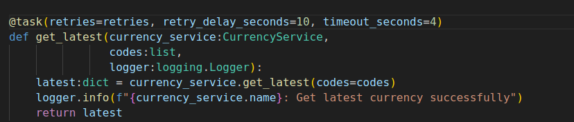
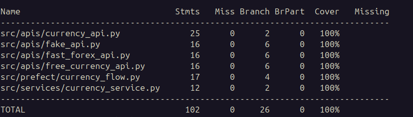

# Currency.Converter.Python

O projeto tem o intuito de obter dados de cotação das seguintes moedas "EUR", "USD", "CAD", "BRL".

Criei o fluxo `currency_flow`, que por sua vez chama duas tasks, sendo a task `get_codes` responsável por obter dados das moedas e a task `get_latest` responsável por obter cotação das moedas.

## Configurando aplicação

```bash
# 1 init pipenv
pipenv shell

#2 install dependencias
pipenv install
```

## Executando o fluxo

```bash
python -m src.prefect
```

## Docker

```bash
# 1 build image
docker compose build --no-cache

#2 run container
docker compose up currency-prefect
```

#### Simulando timeout com Docker

```bash
# 1 build image
docker compose build --no-cache

#2 run container
docker compose up currency-prefect-timeout currency-api-timeout
```


### Observações

#### Estrutura do projeto

Preferei semprar em dois modulos `prefect` e `services`, pelo segunite motivo, numa situação hipotetica em que fosse necessario obtermos dados das moedas e suas cotações através de um api por exemplo, poderiamos cirar um modulo `api`e reaproveitar o código criado no modulo `services`.

#### Tasks

Ambas as tasks podem ser rexecutadas em caso de falhas ao menos 2 vezes além da primeira exeução num intervalor de 10 segundos.




#### Timeout

Afim de simular um timeout, cofigurei um timeout no método `get_latest` na classe `CurrencyService`, onde o valor de timeout é aumentado a cada  falha na execução, devido erro provocado por timeout.


#### Cobertura de testes



#### Minhas redes
[Linkedin](https://www.linkedin.com/in/fernando-cesar-da-silva-4615753a/)
